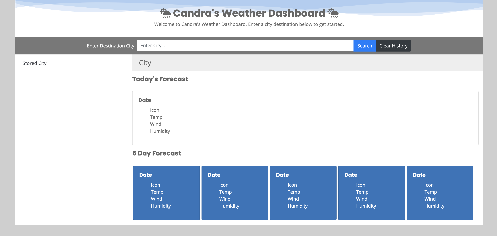

# weather-dashboard
This is a simple weather dashboard application intended for frequent travelers looking to check the 5-day weather forecast of their desired destination city.

## Important URLs

* [Deployed Application URL](https://candracodes.github.io/weather-dashboard/) 
* [GitHub Repo URL](https://github.com/candracodes/weather-dashboard)

## Foreword

* This application aims to accomplish the following:
    * Adhere to the [Assignment Guidelines](./assets/_guide/README.md) to ensure submission is in compliance with acceptance criteria
    * Usage of the [OpenWeather One Call API](https://openweathermap.org/api/one-call-api) to retrieve weather data for cities. 
    * Usage of `localStorage` to store any persistent city-related data. 

## User Story

```
AS A traveler
I WANT to see the weather outlook for multiple cities
SO THAT I can plan a trip accordingly
```

## Acceptance Criteria

```
GIVEN a weather dashboard with form inputs
WHEN I search for a city
THEN I am presented with current and future conditions for that city and that city is added to the search history
WHEN I view current weather conditions for that city
THEN I am presented with the city name, the date, an icon representation of weather conditions, the temperature, the humidity, the wind speed, and the UV index
WHEN I view the UV index
THEN I am presented with a color that indicates whether the conditions are favorable, moderate, or severe
WHEN I view future weather conditions for that city
THEN I am presented with a 5-day forecast that displays the date, an icon representation of weather conditions, the temperature, the wind speed, and the humidity
WHEN I click on a city in the search history
THEN I am again presented with current and future conditions for that city
```

## Mock-Up

* This project should resemble the following screenshot:


## Screenshot

* Here is a screenshot of my developed real application:




## Frameworks and Libraries
The following frameworks are used in this application

* [OpenWeather One Call API](https://openweathermap.org/api/one-call-api) 
* [FontAwesome — v5.8.1](https://fontawesome.com/v5.15/how-to-use/on-the-web/referencing-icons/basic-use)
* [Bootstrap — v4.3.1](https://getbootstrap.com/docs/4.6/getting-started/introduction/)
* [jQuery — v3.2.1](https://api.jquery.com/)


